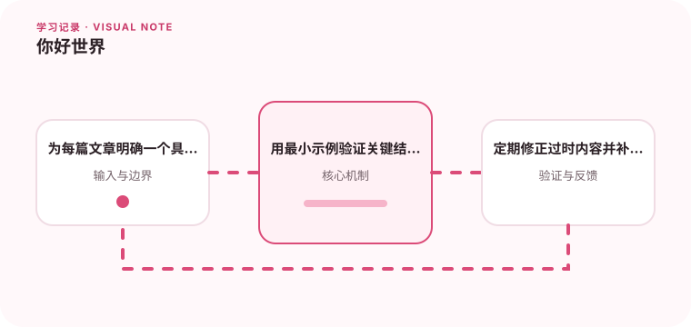

这是本站的第一篇记录，也是把零散学习变成长期知识库的起点。先建立稳定的写作和验证节奏，每一次学习才会留下可复用的结果。

## 为什么值得理解

知识如果只留在浏览器标签和临时笔记里，很快就会失去上下文。建立这个学习站，是为了把“看过”变成“能解释、能验证、能再次使用”。文章不必一次完美，但需要有明确问题和可追溯结论。

## 工作原理

每篇文章按一条简单链路组织：先说明问题为什么出现，再解释核心机制，然后给出可重复的实验和检查清单。SVG 图示用来呈现流程与关系，文字则负责讲清适用边界和失败情况。

## 实战场景

例如学习 CompletableFuture 时，不只抄一段调用代码，还要记录线程池、超时、异常传播和降级行为。如果后来版本升级或场景变化，可以重新运行实验，而不是依赖当时的印象。

## 常见误区

容易出现的问题是只写成功路径、还没验证就复制结论，或者追求发布数量而忽略准确性。技术、API 和安全建议都会过时，所以日期、版本与验证证据应与结论一起保存。

## 实践清单

- 为每篇文章明确一个具体问题。
- 用最小示例验证关键结论。
- 定期修正过时内容并补充来源。
- 记录假设、验证结果和未解决的问题。
- 将稳定结论沉淀为测试或自动化检查。

## 动手练习

选一个最近刚学会的概念，用不超过三百字解释它，再补一个最小示例、一个失败场景和一张流程图。请别人按文章操作，把无法复现的步骤改清楚。

## 小结

“你好世界”只是开始。这个站点的目标，是让每篇文章都能帮助读者理解一个问题、完成一次验证，并知道下一步去哪里。
