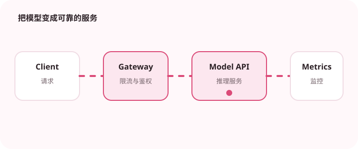

流式输出能降低用户等待感，但也带来取消、拼接和错误展示问题。

## 为什么值得理解

流式响应能缩短首字等待，但完整答案尚未生成时，取消、错误和内容审核都更复杂。产品需要区分首 token 延迟与最终完成时间。

## 工作原理

服务端通常通过 SSE 或流式 HTTP 发送增量事件，客户端按序拼接文本，并处理开始、增量、完成和错误事件。最终结果应保存统一版本。

## 实战场景

长报告生成时，用户可先看到正文并随时取消；引用列表和结构化元数据则在完成事件中一次发送，避免中途状态不完整。

## 常见误区

不要假设每个网络块对应完整 token 或 JSON，UTF-8 与事件边界可能被拆分。连接中断后直接重试还可能产生两份回答和重复计费。

## 实践清单

- 区分首 token 延迟和完整响应延迟。
- 支持用户取消长回答。
- 最终结果需要经过完整性检查。
- 记录模型、提示词、数据和配置版本
- 用固定评测集验证质量、延迟与成本

## 动手练习

实现带序号的 SSE 协议，模拟分块、断线、取消和服务端错误。验证客户端不会乱码，并能区分未完成与完整结果。

## 小结

学习“AI 流式响应的产品体验”时，要把模型能力放进完整系统中判断。输入证据、失败路径、权限、成本和评测缺一不可；只有结果能够复现、解释和回滚，AI 功能才算具备工程可靠性。
