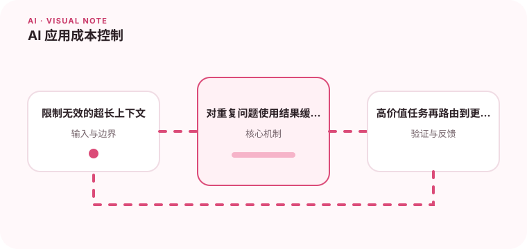

成本控制不只是换便宜模型，还包括上下文、缓存、路由和失败重试。

## 为什么值得理解

AI 成本由输入、输出、检索、工具调用和失败重试共同组成。控制成本应与质量和延迟一起评估，不能只换更便宜模型。

## 工作原理

按功能记录 token、模型、缓存命中和工具次数，建立单请求与用户预算。上下文裁剪、结果缓存和模型路由分别减少无效输入、重复计算和过度能力。

## 实战场景

简单分类可路由到小模型，复杂分析再升级；重复文档摘要可按内容哈希缓存。达到预算上限时，产品应降级或请求用户确认。

## 常见误区

不要只看平均费用，少量超长请求可能贡献大部分成本。无限自动重试、把完整历史重复发送和输出无上限都会造成失控。

## 实践清单

- 限制无效的超长上下文。
- 对重复问题使用结果缓存。
- 高价值任务再路由到更强模型。
- 记录模型、提示词、数据和配置版本
- 用固定评测集验证质量、延迟与成本

## 动手练习

为三类任务统计质量、P95 延迟与每次成本，设计路由和预算告警。模拟模型失败，确认重试次数有上限且不会重复收费动作。

## 小结

学习“AI 应用成本控制”时，要把模型能力放进完整系统中判断。输入证据、失败路径、权限、成本和评测缺一不可；只有结果能够复现、解释和回滚，AI 功能才算具备工程可靠性。
