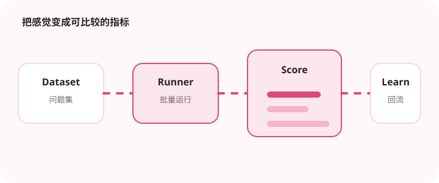

没有评测集，模型升级就只能凭感觉判断。

## 为什么值得理解

评测把“感觉不错”变成可比较证据，是模型、提示词或检索升级的发布门槛。评测集应代表真实任务与失败风险，而不是只包含容易样例。

## 工作原理

离线评测保存输入、参考依据和评分维度，自动评分适合格式与明确答案，人工复核负责语义和风险。线上指标再观察用户反馈、延迟与成本。

## 实战场景

客服助手可分别评估事实正确、引用一致、语气、拒答和处理时长。高风险退款规则应设置硬性门槛，而非与文风分数简单平均。

## 常见误区

不要只用另一个模型打总分，也不要让测试集长期不更新。评测数据泄漏、评分标准模糊和只看均值都会掩盖关键失败。

## 实践清单

- 覆盖正常、边界和对抗输入。
- 分别评估正确性、引用、格式和延迟。
- 把线上失败样本回流到评测集。
- 记录模型、提示词、数据和配置版本
- 用固定评测集验证质量、延迟与成本

## 动手练习

从线上失败中整理五十个样例，写清每个评分标准和证据。对两个版本盲测，分析总分之外的分组退化。

## 小结

学习“如何评测 AI 应用质量”时，要把模型能力放进完整系统中判断。输入证据、失败路径、权限、成本和评测缺一不可；只有结果能够复现、解释和回滚，AI 功能才算具备工程可靠性。
