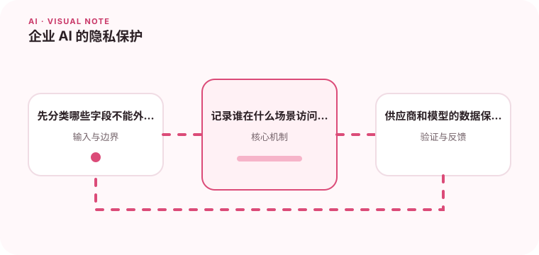

把内部资料交给模型前，需要明确数据分类、用途、保存和访问边界。

## 为什么值得理解

企业 AI 会接触内部文档和用户数据，必须先明确哪些数据可发送、用于什么目的、保存多久以及谁能访问。最小化输入比事后补救更可靠。

## 工作原理

数据分类决定脱敏与模型路由，租户和权限过滤必须在检索前执行。日志只保留必要元数据，供应商的训练与保留策略需要通过合同和技术设置确认。

## 实战场景

员工助手检索人事资料时，只能召回当前用户有权查看的文档；身份证号等字段在发送模型前掩码，审计记录查询人和资料来源。

## 常见误区

不要在提示词中隐藏密钥，也不要认为“企业版”自动满足所有合规要求。向量索引同样可能泄露语义，删除原文后还要处理派生数据。

## 实践清单

- 先分类哪些字段不能外发。
- 记录谁在什么场景访问了什么资料。
- 供应商和模型的数据保留策略要可验证。
- 记录模型、提示词、数据和配置版本
- 用固定评测集验证质量、延迟与成本

## 动手练习

画出一条模型请求的数据流，标记存储、传输和第三方边界。对每个字段决定保留、脱敏或禁止，并验证权限过滤发生在检索前。

## 小结

学习“企业 AI 的隐私保护”时，要把模型能力放进完整系统中判断。输入证据、失败路径、权限、成本和评测缺一不可；只有结果能够复现、解释和回滚，AI 功能才算具备工程可靠性。
