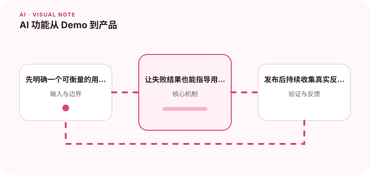

Demo 能回答问题不代表产品已经可靠，产品化需要围绕失败路径设计。

## 为什么值得理解

AI Demo 展示能力上限，产品则必须处理普通输入、失败、成本、权限和持续反馈。先选择一个可衡量任务，比泛化成万能助手更容易交付价值。

## 工作原理

产品流程应定义用户目标、输入边界、模型步骤、兜底和验收指标。高风险结果加入人工确认，线上反馈回流评测集，成本与延迟成为发布约束。

## 实战场景

会议纪要产品可聚焦提取决定和待办，让用户编辑后同步；模型无法识别人名时明确标记，而不是自动发送未经确认的任务。

## 常见误区

不要把聊天框当成完整产品，也不要只展示成功案例。缺少退出路径、用户控制和错误解释，会让偶发失败迅速损害信任。

## 实践清单

- 先明确一个可衡量的用户任务。
- 让失败结果也能指导用户下一步。
- 发布后持续收集真实反馈。
- 记录模型、提示词、数据和配置版本
- 用固定评测集验证质量、延迟与成本

## 动手练习

选择一个用户每周重复的任务，定义节省时间与错误率指标。制作包含失败状态的原型，用真实用户测试并记录修改行为。

## 小结

学习“AI 功能从 Demo 到产品”时，要把模型能力放进完整系统中判断。输入证据、失败路径、权限、成本和评测缺一不可；只有结果能够复现、解释和回滚，AI 功能才算具备工程可靠性。
