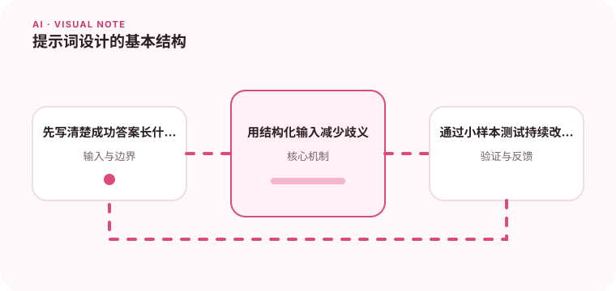

好的提示词会明确目标、输入、约束和输出格式。

## 为什么值得理解

提示词是模型任务的输入契约。明确目标、背景、约束和输出格式，可以减少歧义，也让团队更容易复现与评估改动。

## 工作原理

系统指令设定长期边界，用户内容描述当前任务，示例展示期望映射。模型会综合上下文而非机械执行模板，因此关键约束要清晰、靠近任务并避免互相冲突。

## 实战场景

生成客服摘要时，可给出对话、字段 schema、不得猜测的规则和两个示例。相比只说“总结一下”，结构化要求更容易验证缺失字段与事实一致性。

## 常见误区

不要依赖角色扮演提升事实准确性，也不要无限堆叠“务必”“绝对”。提示词过长会淹没关键输入，隐藏评判标准则无法判断优化是否真实有效。

## 实践清单

- 先写清楚成功答案长什么样。
- 用结构化输入减少歧义。
- 通过小样本测试持续改进。
- 记录模型、提示词、数据和配置版本
- 用固定评测集验证质量、延迟与成本

## 动手练习

为同一抽取任务写简版、结构化版和带示例版提示词，在固定数据集上比较格式通过率、字段准确率、token 与延迟。

## 小结

学习“提示词设计的基本结构”时，要把模型能力放进完整系统中判断。输入证据、失败路径、权限、成本和评测缺一不可；只有结果能够复现、解释和回滚，AI 功能才算具备工程可靠性。
