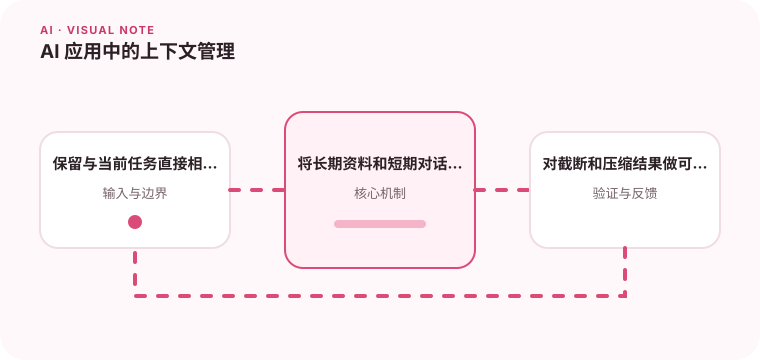

模型回答质量经常受上下文选择影响，而不是只取决于模型本身。

## 为什么值得理解

上下文管理决定模型当前能看到什么。把所有历史与资料全部塞入窗口会增加成本和噪声，正确做法是按任务选择、排序和压缩信息。

## 工作原理

短期对话保存当前意图，长期记忆保存稳定偏好，检索资料提供事实依据。系统需要计算 token 预算，优先保留指令和关键证据，并对被截断内容有明确策略。

## 实战场景

技术助手处理新问题时，可保留最近几轮、用户项目约束和检索到的相关文档，而把早期闲聊压缩成摘要。重要决定应以结构化状态保存。

## 常见误区

不要把模型生成的摘要当成无损记忆，也不要让旧结论覆盖用户最新要求。重复、冲突和低相关资料都会降低模型注意力质量。

## 实践清单

- 保留与当前任务直接相关的信息。
- 将长期资料和短期对话分开管理。
- 对截断和压缩结果做可观测记录。
- 记录模型、提示词、数据和配置版本
- 用固定评测集验证质量、延迟与成本

## 动手练习

构造一段超过窗口预算的对话，分别采用直接截断、滚动摘要和检索记忆。比较关键信息保留率、回答质量与成本。

## 小结

学习“AI 应用中的上下文管理”时，要把模型能力放进完整系统中判断。输入证据、失败路径、权限、成本和评测缺一不可；只有结果能够复现、解释和回滚，AI 功能才算具备工程可靠性。
