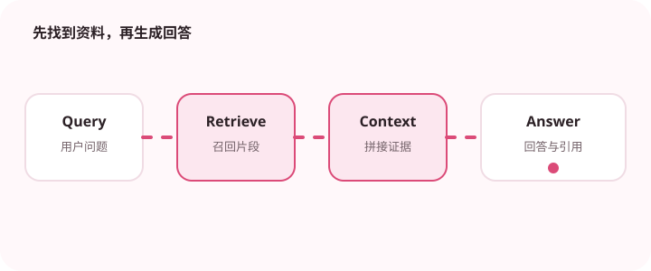

RAG 让模型先找到相关资料，再基于资料回答，从而减少凭空编造。

## 为什么值得理解

RAG 通过先检索资料再生成回答，让知识可更新、结论可引用。它适合私有或频繁变化的信息，但效果取决于整条检索链，而不只是向量数据库。

## 工作原理

文档经过清洗、切分和向量化进入索引；查询被检索并重排，最相关片段连同元数据放入提示词。生成阶段应限定基于证据回答并返回来源。

## 实战场景

企业制度问答中，用户问休假规则，系统应检索当前地区与版本的条款，排除旧文档，再让模型引用具体段落。没有证据时应明确拒答。

## 常见误区

只提高 top-k 可能把更多噪声塞进上下文；切分过细会丢失条件，过大则降低召回。引用存在也不代表结论真的由引用支持。

## 实践清单

- 切分要保持语义完整。
- 召回结果需要评测相关性。
- 答案显示来源，方便用户核验。
- 记录模型、提示词、数据和配置版本
- 用固定评测集验证质量、延迟与成本

## 动手练习

准备二十个带文档答案的问题，逐项评估召回命中、重排位置、答案正确性和引用一致性。针对失败阶段单独调整。

## 小结

学习“RAG 检索增强生成入门”时，要把模型能力放进完整系统中判断。输入证据、失败路径、权限、成本和评测缺一不可；只有结果能够复现、解释和回滚，AI 功能才算具备工程可靠性。
