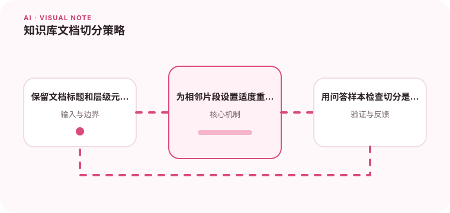

切得太大影响召回精度，切得太小又会丢失上下文。

## 为什么值得理解

切分决定检索系统能否找到完整证据。片段过小缺少上下文，过大则主题混杂并占用更多 token，需要根据文档结构和问答粒度平衡。

## 工作原理

固定长度简单稳定，按标题与段落切分能保留语义层级，重叠用于保留边界上下文。每个片段应携带文档、章节、版本和权限元数据。

## 实战场景

API 文档可按端点和小节切分，把参数表与说明放在同一片段；法律条款则应保留主条款和例外条件，避免回答只引用半句话。

## 常见误区

不要只根据字符数切断代码块或表格，也不要用大重叠掩盖结构问题。重复片段会挤占召回结果，让模型看到多份相同内容。

## 实践清单

- 保留文档标题和层级元数据。
- 为相邻片段设置适度重叠。
- 用问答样本检查切分是否完整。
- 记录模型、提示词、数据和配置版本
- 用固定评测集验证质量、延迟与成本

## 动手练习

选取结构化文档和长散文各一份，比较固定、标题和语义切分。用真实问题检查答案证据是否落在同一片段。

## 小结

学习“知识库文档切分策略”时，要把模型能力放进完整系统中判断。输入证据、失败路径、权限、成本和评测缺一不可；只有结果能够复现、解释和回滚，AI 功能才算具备工程可靠性。
