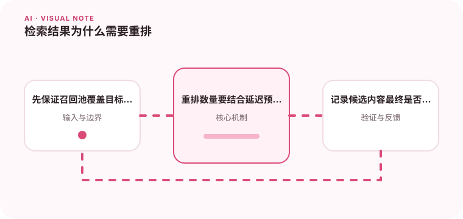

向量相似不一定等于回答相关，重排可以进一步利用查询和候选内容的关系。

## 为什么值得理解

初始向量召回强调速度和覆盖，重排则更精细地判断查询与候选的相关性。两阶段组合能在延迟可控的情况下提高前几名证据质量。

## 工作原理

向量索引先返回较大候选集，cross-encoder 或重排模型同时读取查询与片段并给出分数，最后选择少量内容进入上下文。

## 实战场景

用户问“如何取消已发货订单”时，向量召回可能同时找到取消政策和发货说明；重排应把包含已发货限制的完整条款放在最前。

## 常见误区

候选池没有正确文档时，重排无法创造答案。也不要只看平均排名，关键问题的第一条命中率和额外延迟更贴近产品效果。

## 实践清单

- 先保证召回池覆盖目标内容。
- 重排数量要结合延迟预算。
- 记录候选内容最终是否被使用。
- 记录模型、提示词、数据和配置版本
- 用固定评测集验证质量、延迟与成本

## 动手练习

为固定查询保存初召回前二十条，加入重排后计算 MRR、Recall@k 与延迟。检查被错误降权的长文档和关键词问题。

## 小结

学习“检索结果为什么需要重排”时，要把模型能力放进完整系统中判断。输入证据、失败路径、权限、成本和评测缺一不可；只有结果能够复现、解释和回滚，AI 功能才算具备工程可靠性。
