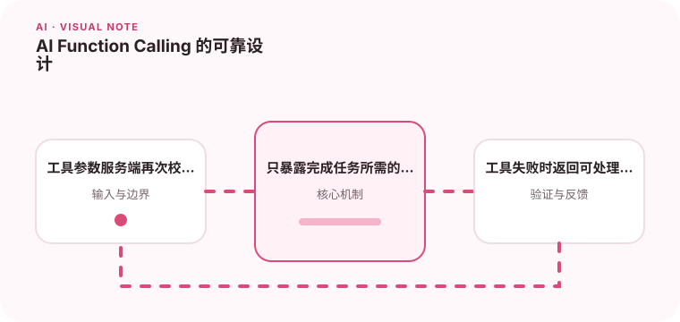

工具调用让模型连接真实系统，但工具接口必须像公共 API 一样严格。

## 为什么值得理解

Function Calling 让模型把自然语言意图转换为结构化工具请求，但真正执行权仍应掌握在应用端。工具 schema、权限和确认流程决定系统安全性。

## 工作原理

模型根据名称、描述和 JSON Schema 选择工具并生成参数，应用验证后执行，再把结果返回模型继续组织答案。每一步都可能失败，需要限制循环次数和超时。

## 实战场景

预约助手可以先查询空闲时间，再生成预约参数；真正创建前向用户展示日期、参与人和时区并确认。删除或付款等高风险操作应增加审批。

## 常见误区

不要直接执行未经校验的参数，也不要在工具描述中暴露管理员能力。模型返回工具名并不表示用户有权限，工具结果也可能包含恶意文本。

## 实践清单

- 工具参数服务端再次校验。
- 只暴露完成任务所需的最小权限。
- 工具失败时返回可处理的结构化错误。
- 记录模型、提示词、数据和配置版本
- 用固定评测集验证质量、延迟与成本

## 动手练习

设计查询与修改两个工具，加入 schema 校验、权限和幂等键。模拟参数缺失、工具超时和提示注入，验证执行层能安全拒绝。

## 小结

学习“AI Function Calling 的可靠设计”时，要把模型能力放进完整系统中判断。输入证据、失败路径、权限、成本和评测缺一不可；只有结果能够复现、解释和回滚，AI 功能才算具备工程可靠性。
