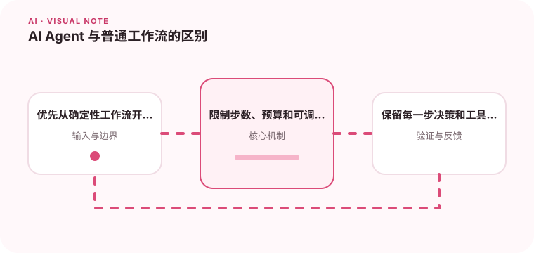

Agent 的核心是根据环境反馈选择下一步，而不是简单地把几段提示词串起来。

## 为什么值得理解

Agent 会根据目标和环境反馈选择下一步，适合路径无法预先完全确定的任务。自主性越高，成本、错误传播和权限风险也越大。

## 工作原理

典型循环包括观察状态、规划动作、调用工具、读取结果和判断是否结束。系统应限制步数、预算、工具集合，并保存每一步轨迹用于审计。

## 实战场景

排查线上告警时，Agent 可先查指标，再根据异常选择日志或变更记录；若发现需要修改配置，应停在建议阶段等待人工确认。

## 常见误区

不要把固定三步流程包装成 Agent 增加不确定性，也不要允许模型无限反思。工具失败和重复动作若没有终止条件，会快速消耗预算。

## 实践清单

- 优先从确定性工作流开始。
- 限制步数、预算和可调用工具。
- 保留每一步决策和工具结果。
- 记录模型、提示词、数据和配置版本
- 用固定评测集验证质量、延迟与成本

## 动手练习

实现一个只读诊断 Agent，最多调用五次工具。准备正常、无结果和工具失败场景，检查它能否停止并说明证据不足。

## 小结

学习“AI Agent 与普通工作流的区别”时，要把模型能力放进完整系统中判断。输入证据、失败路径、权限、成本和评测缺一不可；只有结果能够复现、解释和回滚，AI 功能才算具备工程可靠性。
