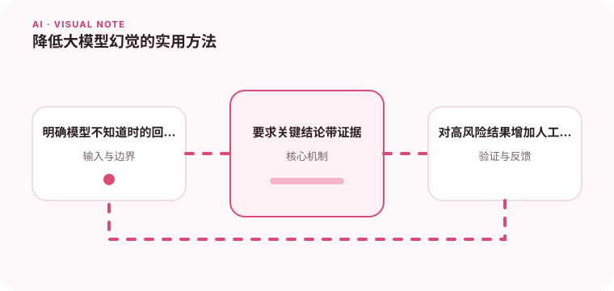

幻觉不能只靠一句不要编造来解决，需要从资料、流程和输出验证共同控制。

## 为什么值得理解

幻觉是模型生成看似合理但缺乏依据的内容。降低风险需要同时改善资料、提示、工具和输出验证，而不是只增加一句“不要编造”。

## 工作原理

系统可通过检索提供证据、要求逐条引用、设置无证据拒答，并对日期、数字和实体做二次校验。置信度必须来自可解释信号，而非模型自报。

## 实战场景

政策问答若未检索到适用地区条款，应回复资料不足并建议人工渠道，而不是从相似地区规则补全。引用内容还要验证是否支持对应结论。

## 常见误区

不要把低温度等同于事实可靠，也不要因为回答带链接就放弃核验。模型可能引用错误段落，或用正确资料推出不成立的结论。

## 实践清单

- 明确模型不知道时的回答方式。
- 要求关键结论带证据。
- 对高风险结果增加人工确认。
- 记录模型、提示词、数据和配置版本
- 用固定评测集验证质量、延迟与成本

## 动手练习

准备含无答案、冲突资料和过期文档的问题，比较自由回答、RAG 与强制引用方案。统计错误回答和正确拒答，而非只看回答率。

## 小结

学习“降低大模型幻觉的实用方法”时，要把模型能力放进完整系统中判断。输入证据、失败路径、权限、成本和评测缺一不可；只有结果能够复现、解释和回滚，AI 功能才算具备工程可靠性。
