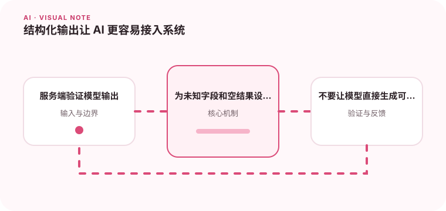

JSON Schema 等结构化约束可以减少解析失败和字段漂移。

## 为什么值得理解

结构化输出让模型结果可以被程序稳定解析，适合抽取、分类和工具参数。Schema 同时限制字段形状并明确后续系统能接受什么。

## 工作原理

JSON Schema 定义类型、枚举、必填和嵌套结构，模型按约束生成后，应用仍要执行运行时验证。失败可有限重试或返回明确错误。

## 实战场景

发票抽取应输出供应商、日期、币种和明细数组，金额使用统一格式；缺失字段标为 null 并附证据位置，而不是随意猜值。

## 常见误区

不要用正则从自由文本截取 JSON，也不要直接信任结构正确就代表内容正确。Schema 过度复杂会降低成功率，字段描述模糊也会导致语义漂移。

## 实践清单

- 服务端验证模型输出。
- 为未知字段和空结果设计兼容处理。
- 不要让模型直接生成可执行 SQL 或命令。
- 记录模型、提示词、数据和配置版本
- 用固定评测集验证质量、延迟与成本

## 动手练习

为一个抽取任务定义最小 Schema，准备缺字段、多语言和错误格式输入。统计解析通过率与字段准确率，分别处理两类失败。

## 小结

学习“结构化输出让 AI 更容易接入系统”时，要把模型能力放进完整系统中判断。输入证据、失败路径、权限、成本和评测缺一不可；只有结果能够复现、解释和回滚，AI 功能才算具备工程可靠性。
