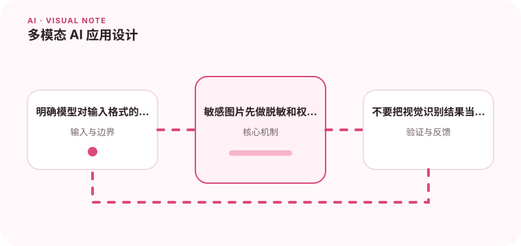

图像、文本和音频组合后，输入预处理和输出验证会变得更重要。

## 为什么值得理解

多模态模型同时处理文本、图像或音频，使系统能理解更丰富输入，也增加预处理、隐私和错误解释难度。每种模态都需要独立质量检查。

## 工作原理

图片会被缩放并编码为视觉 token，音频通常先分帧或转写，再与文本上下文联合推理。分辨率、顺序和提示会影响模型关注内容。

## 实战场景

报销审核可让模型读取票据图片并提取字段，但模糊金额要标记低置信并交人工复核。原图、OCR 和最终字段应能互相追溯。

## 常见误区

不要把视觉回答当成像素级事实，模型可能忽略小字或混淆相似对象。上传内容还可能包含人脸、证件和隐藏提示，需要权限与脱敏。

## 实践清单

- 明确模型对输入格式的限制。
- 敏感图片先做脱敏和权限检查。
- 不要把视觉识别结果当作绝对事实。
- 记录模型、提示词、数据和配置版本
- 用固定评测集验证质量、延迟与成本

## 动手练习

准备清晰、模糊、旋转和含干扰文字的图片集，评估字段准确率与拒答。比较原图、OCR 和多模态联合方案。

## 小结

学习“多模态 AI 应用设计”时，要把模型能力放进完整系统中判断。输入证据、失败路径、权限、成本和评测缺一不可；只有结果能够复现、解释和回滚，AI 功能才算具备工程可靠性。
