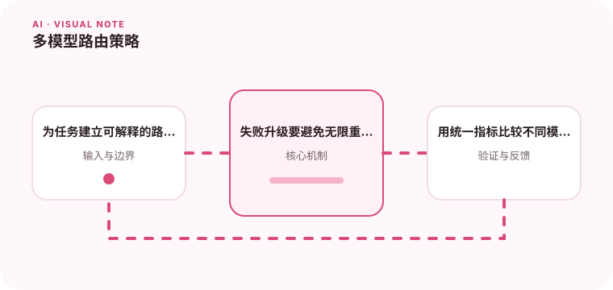

不同模型在成本、速度、上下文和推理能力上各有取舍。

## 为什么值得理解

模型路由根据任务难度、风险、成本和延迟选择不同模型，让简单请求不必使用最昂贵能力，同时为复杂任务保留升级路径。

## 工作原理

路由器可使用规则、轻量分类器或置信信号判断任务类型，调用后再根据格式失败或评测分数升级。所有路径应共享稳定输入输出协议。

## 实战场景

情感分类和格式转换走小模型，涉及多文档推理的请求走强模型；高风险医疗内容无论模型多强都进入人工审核。

## 常见误区

不要只按提示长度判断难度，也不要在失败时无限级联模型。路由策略若缺少版本和观测，会让质量变化无法归因。

## 实践清单

- 为任务建立可解释的路由规则。
- 失败升级要避免无限重试。
- 用统一指标比较不同模型结果。
- 记录模型、提示词、数据和配置版本
- 用固定评测集验证质量、延迟与成本

## 动手练习

建立三档任务集，比较不同模型的质量、成本与延迟，制定可解释路由规则。模拟模型不可用并验证降级与预算上限。

## 小结

学习“多模型路由策略”时，要把模型能力放进完整系统中判断。输入证据、失败路径、权限、成本和评测缺一不可；只有结果能够复现、解释和回滚，AI 功能才算具备工程可靠性。
