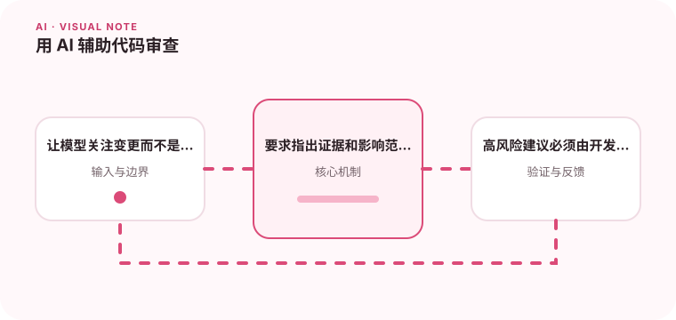

AI 可以帮助发现重复模式和明显风险，但不能代替对业务约束的理解。

## 为什么值得理解

AI 代码审查适合发现常见风险、遗漏测试和重复模式，但它不了解全部业务背景。建议必须带具体代码证据和影响路径，最终由开发者验证。

## 工作原理

系统应提供变更 diff、相关接口与项目规则，要求模型按正确性、安全、性能和可维护性分类。评论经过去重和置信筛选后再展示。

## 实战场景

数据库迁移 PR 中，模型可以指出缺少索引或回滚，但是否允许长锁表需要结合真实数据量和发布窗口，由负责人判断。

## 常见误区

不要把整个仓库无差别塞入上下文，也不要让模型自动提交高风险修复。过多风格评论会稀释真正缺陷，错误建议还可能诱导引入漏洞。

## 实践清单

- 让模型关注变更而不是扫描所有代码。
- 要求指出证据和影响范围。
- 高风险建议必须由开发者验证。
- 记录模型、提示词、数据和配置版本
- 用固定评测集验证质量、延迟与成本

## 动手练习

选取十个历史 PR 和已知缺陷做盲测，统计有效评论、误报和遗漏。要求每条建议提供代码位置、触发条件和验证步骤。

## 小结

学习“用 AI 辅助代码审查”时，要把模型能力放进完整系统中判断。输入证据、失败路径、权限、成本和评测缺一不可；只有结果能够复现、解释和回滚，AI 功能才算具备工程可靠性。
