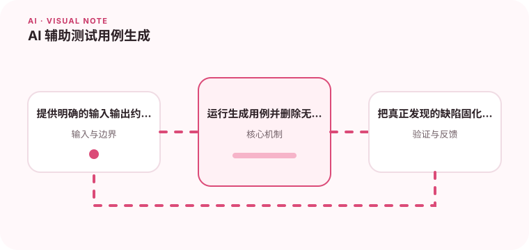

模型适合补充边界输入和测试思路，最终测试仍需要可重复和可维护。

## 为什么值得理解

AI 可以补充边界输入和测试思路，尤其适合根据函数契约生成候选用例。但生成代码必须运行、去重并由维护者确认业务价值。

## 工作原理

提供接口、约束和已有测试后，模型可列出等价类、边界和异常路径，再生成可执行用例。运行结果和覆盖变化用于筛选，而非按生成数量评估。

## 实战场景

金额计算函数可让模型考虑零值、负数、舍入、极大值和币种差异。真正发现的缺陷应固化成命名清楚的回归测试。

## 常见误区

不要接受只断言“不抛异常”的弱测试，也不要让模型复制实现逻辑计算期望值。随机生成大量相似用例会增加维护成本而不提高信心。

## 实践清单

- 提供明确的输入输出约束。
- 运行生成用例并删除无价值重复项。
- 把真正发现的缺陷固化为回归测试。
- 记录模型、提示词、数据和配置版本
- 用固定评测集验证质量、延迟与成本

## 动手练习

选择一个有明确契约的模块，让模型先列测试矩阵再生成代码。运行变异测试或故意注入错误，检查用例是否真的能捕获。

## 小结

学习“AI 辅助测试用例生成”时，要把模型能力放进完整系统中判断。输入证据、失败路径、权限、成本和评测缺一不可；只有结果能够复现、解释和回滚，AI 功能才算具备工程可靠性。
