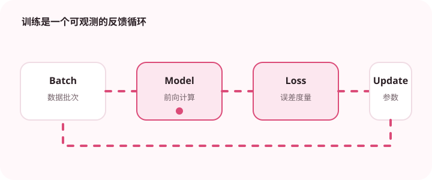

微调适合改变稳定的表达或任务模式，不适合替代经常更新的知识库。

## 为什么值得理解

微调适合让模型稳定学习特定任务格式、术语或风格，不适合存储频繁变化的事实。是否微调应与提示、RAG 和工作流改造进行对比。

## 工作原理

监督微调使用输入输出样本调整权重，训练集质量和覆盖决定模型行为。验证集监控泛化，学习率、轮次和数据配比影响过拟合与遗忘。

## 实战场景

客服分类长期有稳定标签和大量高质量历史样本时，可微调小模型提升一致性；最新产品政策仍应通过检索注入。

## 常见误区

不要把未经清洗的聊天记录直接训练，也不要只看训练损失。样本泄漏、标签不一致和缺少基线会让微调效果无法判断。

## 实践清单

- 先用高质量样本验证是否真有模式缺口。
- 知识更新优先考虑检索。
- 微调前后用同一评测集比较。
- 记录模型、提示词、数据和配置版本
- 用固定评测集验证质量、延迟与成本

## 动手练习

整理一组去重、脱敏且标签一致的数据，先建立提示词基线，再微调并用同一评测集比较。检查少数类和旧能力是否退化。

## 小结

学习“什么时候需要微调模型”时，要把模型能力放进完整系统中判断。输入证据、失败路径、权限、成本和评测缺一不可；只有结果能够复现、解释和回滚，AI 功能才算具备工程可靠性。
