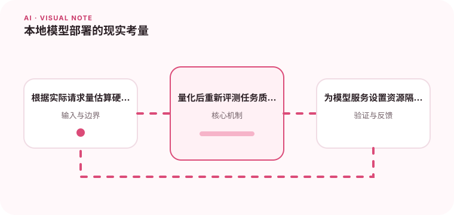

本地部署带来数据控制和延迟优势，也需要承担硬件、更新和运维成本。

## 为什么值得理解

本地部署模型提供数据控制和可定制性，但需要承担硬件、推理优化、升级与运维成本。选择应基于真实请求量和质量门槛。

## 工作原理

模型权重加载到 CPU 或 GPU，量化降低显存与带宽，批处理提高吞吐但增加单请求等待。服务层还需处理队列、缓存和健康状态。

## 实战场景

内部代码补全若对隐私敏感，可部署量化模型并限制上下文长度。根据并发测试设置批大小和队列上限，而不是只看单次演示速度。

## 常见误区

不要只依据模型文件大小估算显存，也不要忽略 KV cache、并发和上下文。量化后必须重新评测，驱动与算子版本也会影响稳定性。

## 实践清单

- 根据实际请求量估算硬件。
- 量化后重新评测任务质量。
- 为模型服务设置资源隔离和健康检查。
- 记录模型、提示词、数据和配置版本
- 用固定评测集验证质量、延迟与成本

## 动手练习

选取目标模型在真实硬件上测试不同量化和批大小，记录质量、首 token、吞吐和峰值显存。模拟过载并验证限流。

## 小结

学习“本地模型部署的现实考量”时，要把模型能力放进完整系统中判断。输入证据、失败路径、权限、成本和评测缺一不可；只有结果能够复现、解释和回滚，AI 功能才算具备工程可靠性。
