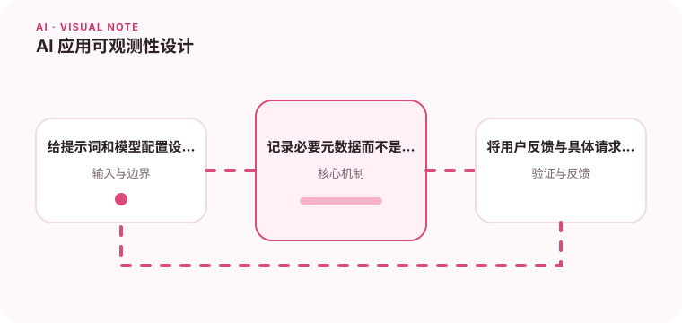

AI 请求除了延迟和错误，还需要记录模型、提示词版本、token 和检索结果。

## 为什么值得理解

AI 应用除普通延迟和错误外，还要观察模型版本、提示词、token、检索证据、工具调用与用户反馈。没有这些信息，质量退化很难归因。

## 工作原理

每次请求生成 traceId，记录配置版本和阶段耗时；敏感输入做脱敏或摘要。指标聚合成功率、拒答、成本和延迟，样本用于离线复盘。

## 实战场景

RAG 回答变差时，可沿 trace 查看查询、召回片段、重排分数和最终引用，判断问题来自索引、提示还是模型升级。

## 常见误区

不要原样永久保存所有提示和回答，也不要把高基数用户 ID 直接作为指标标签。只记录总 token 而不分阶段，也无法定位浪费。

## 实践清单

- 给提示词和模型配置设置版本号。
- 记录必要元数据而不是原样保存所有隐私内容。
- 将用户反馈与具体请求关联。
- 记录模型、提示词、数据和配置版本
- 用固定评测集验证质量、延迟与成本

## 动手练习

为一条模型请求贯穿检索、生成和工具调用建立 trace，制造空召回与超时。验证看板能定位阶段，同时日志已脱敏。

## 小结

学习“AI 应用可观测性设计”时，要把模型能力放进完整系统中判断。输入证据、失败路径、权限、成本和评测缺一不可；只有结果能够复现、解释和回滚，AI 功能才算具备工程可靠性。
