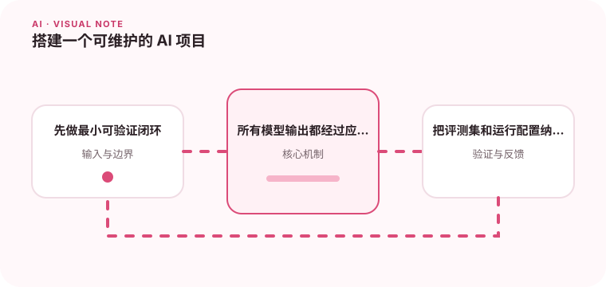

可维护的 AI 系统需要把模型调用、提示词、检索、工具和评测拆成可替换模块。

## 为什么值得理解

可维护的 AI 项目应把模型调用、提示、检索、工具和评测拆成可替换模块，同时保留统一请求轨迹。这样升级某一环节时能独立验证影响。

## 工作原理

应用层编排任务，模型网关统一供应商差异，检索层返回证据，工具层执行受控动作，评测层保存固定数据与指标。配置和提示都需要版本管理。

## 实战场景

知识助手可先完成“基于一组文档回答并引用”的最小闭环，再加入权限、缓存和工具。每次扩展都用同一评测集检查质量与成本。

## 常见误区

不要在业务代码散落模型 SDK 调用，也不要把提示词只放在线上控制台。没有超时、预算和降级的链路，一次供应商故障就会拖垮应用。

## 实践清单

- 先做最小可验证闭环。
- 所有模型输出都经过应用层校验。
- 把评测集和运行配置纳入版本管理。
- 记录模型、提示词、数据和配置版本
- 用固定评测集验证质量、延迟与成本

## 动手练习

搭建一个含模型网关、RAG、评测和追踪的最小项目，替换一次模型实现，确认业务接口不变，并比较前后质量、延迟与成本。

## 小结

学习“搭建一个可维护的 AI 项目”时，要把模型能力放进完整系统中判断。输入证据、失败路径、权限、成本和评测缺一不可；只有结果能够复现、解释和回滚，AI 功能才算具备工程可靠性。
