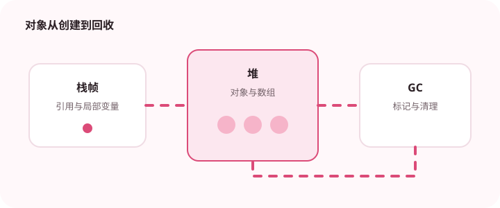

理解堆、栈、方法区和直接内存的职责，才能解释常见的内存溢出问题。

## 为什么值得理解

JVM 内存模型决定了对象放在哪里、能活多久，以及故障发生时应该查看哪类证据。理解这些区域后，StackOverflowError、堆溢出和直接内存不足就不再是同一种模糊的“内存问题”。

## 工作原理

每次方法调用都会在线程栈中创建栈帧，new 出来的普通对象通常进入堆，类结构与常量由元空间等区域管理。垃圾回收器从 GC Roots 出发判断对象是否可达，而不是按对象“用没用过”来猜测。

## 实战场景

一个导出服务运行数小时后内存持续上涨，可以先观察堆使用曲线，再比较多次堆转储中的对象数量与引用链。如果堆稳定但进程内存仍增长，还要检查直接缓冲区、本地库和线程数量。

## 常见误区

常见误区是看到 OOM 就提高 -Xmx。这样可能只是推迟故障，并增加回收停顿。还要区分对象泄漏与正常缓存增长，避免仅凭一次快照下结论。

## 实践清单

- 区分栈帧、堆对象和类元数据的生命周期。
- 用堆转储和 GC 日志定位异常增长。
- 避免把所有内存问题都归结为简单的调大堆。
- 记录关键假设、验证数据和回滚条件
- 将稳定结论沉淀为测试或自动化检查

## 动手练习

编写一个分别制造深递归、对象滞留和直接缓冲区增长的小程序，用 jcmd、jmap 或分析器观察三种故障的指标差异，并记录最有效的定位证据。

## 小结

学习“Java JVM 内存区域与对象生命周期”时，重点不是记住全部术语，而是能解释机制、识别边界并用证据验证选择。把实验结果、失败样本和决策依据一起留下，下一次面对类似问题时才能更快做出可靠判断。
