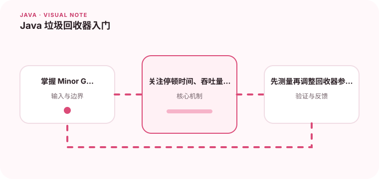

垃圾回收不是定时清空内存，而是根据对象可达性管理空间。

## 为什么值得理解

垃圾回收器的选择会影响吞吐量、停顿时间和资源占用。业务关心的是请求是否稳定完成，而不是某个回收器名字是否“最新”，因此需要从延迟目标和堆规模出发判断。

## 工作原理

可达对象会继续存活，不可达对象才具备回收条件。分代设计利用大多数对象朝生夕灭的特点，让年轻代频繁回收，存活较久的对象进入老年代；不同回收器再用并行或并发方式完成标记、整理。

## 实战场景

接口出现周期性长尾延迟时，应把请求延迟与 GC 日志时间轴对齐，观察停顿原因、晋升速度和回收后占用。若回收后老年代仍很高，问题可能在对象生命周期或缓存策略，而非回收频率。

## 常见误区

不要只比较平均停顿，也不要把 Minor、Major、Full GC 混为一谈。开启过多日志本身不是问题，但必须能关联应用版本和流量，否则数据很难解释。

## 实践清单

- 掌握 Minor GC、Major GC 和 Full GC 的区别。
- 关注停顿时间、吞吐量和内存占用三个指标。
- 先测量再调整回收器参数。
- 记录关键假设、验证数据和回滚条件
- 将稳定结论沉淀为测试或自动化检查

## 动手练习

用固定请求负载运行同一程序，分别记录堆较小和较大时的吞吐、P99 延迟及回收次数。根据证据解释变化，而不是先修改十几个 JVM 参数。

## 小结

学习“Java 垃圾回收器入门”时，重点不是记住全部术语，而是能解释机制、识别边界并用证据验证选择。把实验结果、失败样本和决策依据一起留下，下一次面对类似问题时才能更快做出可靠判断。
