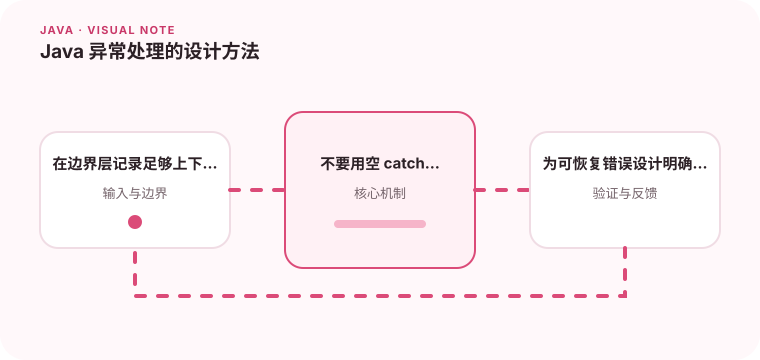

异常应该帮助调用方做出正确决策，而不是把错误悄悄吞掉。

## 为什么值得理解

异常是调用方理解失败原因的协议。设计清楚的异常层次，可以让接口决定重试、提示用户还是终止事务，也能避免底层数据库或网络细节泄漏到业务边界。

## 工作原理

底层异常应在有语义的边界转换，例如把唯一键冲突映射成“资源已存在”，同时通过异常链保留根因。可恢复错误与编程错误要分开，错误码、消息和日志字段也承担不同职责。

## 实战场景

支付接口调用超时时，服务层不能简单返回 null。它应区分“明确失败”和“结果未知”，保存业务流水号，并允许后续查询或补偿，避免调用方盲目重试造成重复扣款。

## 常见误区

最危险的写法是空 catch、只打印 message 后继续执行，或用一个 RuntimeException 包住所有失败。它们会丢失上下文，也让监控无法按错误类型聚合。

## 实践清单

- 在边界层记录足够上下文。
- 不要用空 catch 或返回 null 掩盖失败。
- 为可恢复错误设计明确的重试或降级策略。
- 记录关键假设、验证数据和回滚条件
- 将稳定结论沉淀为测试或自动化检查

## 动手练习

为文件读取、参数校验和远程超时设计三类异常，写测试验证状态码、用户提示和日志根因。再检查敏感参数是否被意外写入错误消息。

## 小结

学习“Java 异常处理的设计方法”时，重点不是记住全部术语，而是能解释机制、识别边界并用证据验证选择。把实验结果、失败样本和决策依据一起留下，下一次面对类似问题时才能更快做出可靠判断。
