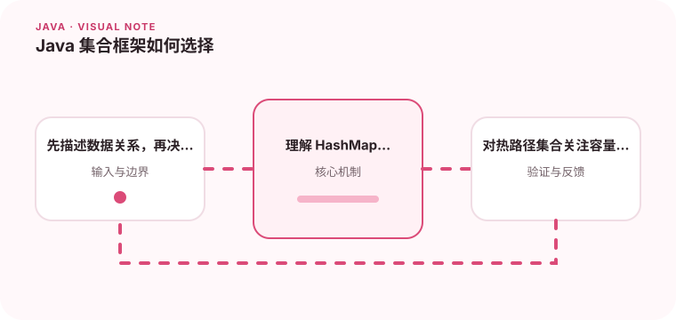

List、Set、Map 的选择会直接影响代码表达和运行效率。

## 为什么值得理解

集合类型表达的是数据关系，而不仅是容器语法。顺序、重复、键值映射和并发访问要求不同，选择错误会让代码充满额外判断，并在数据量增大后暴露性能问题。

## 工作原理

ArrayList 适合按索引读取和尾部追加，HashSet 用哈希去重，HashMap 通过键定位值。哈希集合依赖稳定的 equals 与 hashCode；有序需求则要考虑 LinkedHashMap、TreeMap 或显式排序。

## 实战场景

处理订单明细时，如果需求是保留输入顺序并按商品编号去重，可以先明确冲突时保留第一条还是最后一条，再选择 LinkedHashMap，而不是先塞进 HashSet 后发现顺序丢失。

## 常见误区

常见误区包括在遍历时直接修改普通集合、把可变对象作为 Map 键，以及忽略扩容成本。并发场景也不能只用 synchronized 包住零散操作，因为复合逻辑仍可能竞态。

## 实践清单

- 先描述数据关系，再决定接口类型。
- 理解 HashMap 的哈希、扩容和碰撞。
- 对热路径集合关注容量和装箱成本。
- 记录关键假设、验证数据和回滚条件
- 将稳定结论沉淀为测试或自动化检查

## 动手练习

为十万条数据分别实现查找、去重和排序，比较 List、Set、Map 的表达方式与耗时。随后修改键对象的字段，观察哈希集合为何可能再也找不到它。

## 小结

学习“Java 集合框架如何选择”时，重点不是记住全部术语，而是能解释机制、识别边界并用证据验证选择。把实验结果、失败样本和决策依据一起留下，下一次面对类似问题时才能更快做出可靠判断。
