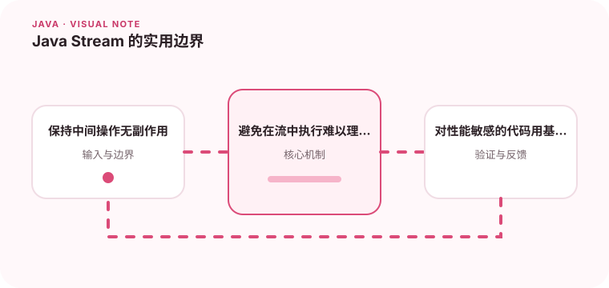

Stream 适合表达数据变换，但并不是所有循环都应该改写成链式操作。

## 为什么值得理解

Stream 擅长描述“从一组数据得到另一组数据”的变换过程，尤其适合过滤、映射和聚合。它的价值是让意图集中，而不是把任何 for 循环都改成更长的链式调用。

## 工作原理

数据源经过一系列惰性的中间操作，直到终止操作才真正遍历。filter 决定保留什么，map 改变元素形态，collect 负责汇总；同一个流消费后不能再次使用。

## 实战场景

统计每个部门的有效订单金额时，可以先过滤无效状态，再按部门分组并求和。若处理中还要调用远程接口或修改共享对象，普通循环往往更容易控制错误和节流。

## 常见误区

不要在 peek 中隐藏业务副作用，也不要默认 parallelStream 一定更快。并行流使用公共线程池，对阻塞 I/O、少量数据和有顺序要求的任务可能更慢甚至干扰其他请求。

## 实践清单

- 保持中间操作无副作用。
- 避免在流中执行难以理解的嵌套副作用。
- 对性能敏感的代码用基准测试验证。
- 记录关键假设、验证数据和回滚条件
- 将稳定结论沉淀为测试或自动化检查

## 动手练习

用一份订单列表分别实现循环版和 Stream 版，覆盖空列表、重复数据与异常金额。比较可读性后，再用基准测试验证串行流和并行流的实际差异。

## 小结

学习“Java Stream 的实用边界”时，重点不是记住全部术语，而是能解释机制、识别边界并用证据验证选择。把实验结果、失败样本和决策依据一起留下，下一次面对类似问题时才能更快做出可靠判断。
