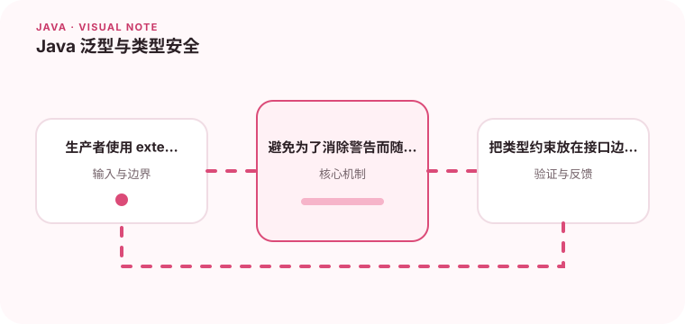

泛型让集合和接口在编译期表达元素类型，减少运行时类型错误。

## 为什么值得理解

泛型把类型错误提前到编译期，并让容器、算法和接口保留输入输出关系。理解泛型后，可以减少强制转换，也能设计出更小、更准确的公共 API。

## 工作原理

类型参数在编译期参与检查，运行时通常经过擦除。? extends T 表示读取 T 的生产者，? super T 表示接收 T 的消费者；不变性意味着 List<Integer> 不是 List<Number>。

## 实战场景

实现一个把子类型事件写入处理器的方法时，输入集合可以使用 extends，目标消费者使用 super。这样调用方既能传具体事件列表，也不需要把类型退化成 Object。

## 常见误区

常见误区是用原始类型绕过检查、为消除警告随意强转，或把通配符放在返回值上导致调用困难。泛型层次过深也会让错误信息和接口语义变得难读。

## 实践清单

- 生产者使用 extends，消费者使用 super。
- 避免为了消除警告而随意添加 unchecked。
- 把类型约束放在接口边界上。
- 记录关键假设、验证数据和回滚条件
- 将稳定结论沉淀为测试或自动化检查

## 动手练习

实现一个类型安全的分页结果和复制方法，分别测试 Number、Integer 与 Object 的组合。解释哪些方向能赋值，并用 PECS 原则验证接口是否自然。

## 小结

学习“Java 泛型与类型安全”时，重点不是记住全部术语，而是能解释机制、识别边界并用证据验证选择。把实验结果、失败样本和决策依据一起留下，下一次面对类似问题时才能更快做出可靠判断。
