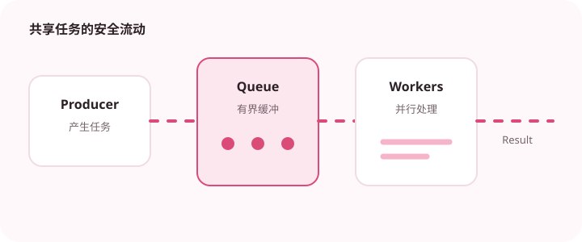

可见性、原子性和有序性是理解线程安全的起点。

## 为什么值得理解

并发问题通常不是“多开几个线程”，而是共享状态在不同执行单元之间如何被读取和修改。可见性、原子性与有序性是判断线程安全的三个入口。

## 工作原理

synchronized 在同一把锁上建立互斥与内存可见性，volatile 保证读写可见和部分有序，但不能让 count++ 变成原子操作。锁、原子类与消息传递各自适合不同状态模型。

## 实战场景

库存扣减同时收到多个请求时，先确认最终一致性要求，再选择数据库原子更新、锁或串行队列。仅在 Java 内存中加锁，无法保护多实例部署下的共享库存。

## 常见误区

常见误区是锁住了不同对象却以为互斥、在持锁期间调用慢接口，以及忽略锁顺序造成死锁。并发测试偶尔通过也不能证明实现安全。

## 实践清单

- volatile 解决可见性，不等于复合操作原子化。
- 缩小锁的范围并保持锁顺序一致。
- 优先使用并发工具类而不是手写线程协作。
- 记录关键假设、验证数据和回滚条件
- 将稳定结论沉淀为测试或自动化检查

## 动手练习

实现一个多线程计数器，分别使用普通 int、volatile、synchronized 和 AtomicInteger。运行足够多次，记录错误结果与吞吐差异，再说明每种方案的边界。

## 小结

学习“Java 并发编程的三个基本问题”时，重点不是记住全部术语，而是能解释机制、识别边界并用证据验证选择。把实验结果、失败样本和决策依据一起留下，下一次面对类似问题时才能更快做出可靠判断。
