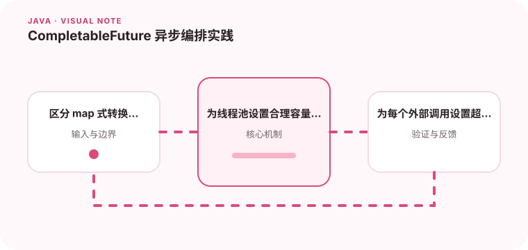

异步任务的价值在于组合等待、错误处理和超时，而不仅是开一个新线程。

## 为什么值得理解

CompletableFuture 适合编排多个相互依赖的异步步骤，让成功、异常和超时路径保持在同一条流程中。它解决的是组合问题，不只是把代码放到另一个线程。

## 工作原理

thenApply 转换已有结果，thenCompose 串联返回新 Future 的异步步骤，allOf 等待多个独立任务。每个阶段在哪个线程池执行、异常如何传播，都需要显式理解。

## 实战场景

聚合用户主页时，资料、订单和推荐可以并行查询，再统一组装。每个依赖都应有独立超时，推荐失败可以降级为空列表，而用户资料失败则可能直接终止请求。

## 常见误区

不要滥用公共 ForkJoinPool，也不要在异步回调里继续阻塞等待同一线程池任务。只在最后调用 join 而不处理异常，会把真正根因包在 CompletionException 中。

## 实践清单

- 区分 map 式转换和异步任务串联。
- 为线程池设置合理容量和命名。
- 为每个外部调用设置超时与兜底。
- 记录关键假设、验证数据和回滚条件
- 将稳定结论沉淀为测试或自动化检查

## 动手练习

搭建三个延迟不同的模拟服务，组合串行、并行、超时和降级路径。给线程命名并记录 traceId，观察异常在哪个阶段出现、总耗时如何变化。

## 小结

学习“CompletableFuture 异步编排实践”时，重点不是记住全部术语，而是能解释机制、识别边界并用证据验证选择。把实验结果、失败样本和决策依据一起留下，下一次面对类似问题时才能更快做出可靠判断。
