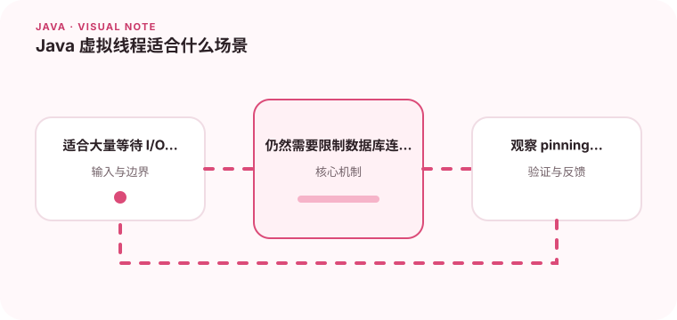

虚拟线程降低了高并发 I/O 任务的编程成本，但不能消除数据库和下游服务的容量限制。

## 为什么值得理解

虚拟线程让“一请求一线程”的阻塞式写法能够承载更多并发 I/O，但它并没有创造更多数据库连接、CPU 或下游容量。使用前要先判断瓶颈是不是线程等待。

## 工作原理

虚拟线程由 JVM 调度到较少的平台线程上，遇到多数阻塞操作时可以卸载，让载体线程执行其他任务。CPU 密集计算仍然受核心数限制，某些固定或本地调用还可能造成 pinning。

## 实战场景

大量请求都在等待 HTTP 响应时，虚拟线程可以简化代码并降低线程栈成本；但数据库连接池只有五十个连接时，仍应限制并发，防止请求在连接池前无限排队。

## 常见误区

常见误区是把虚拟线程当成自动限流器，或继续维护按平台线程设计的巨大线程池。ThreadLocal 使用过多也会在海量虚拟线程下增加内存压力。

## 实践清单

- 适合大量等待 I/O 的短任务。
- 仍然需要限制数据库连接和外部请求并发。
- 观察 pinning、队列长度和下游延迟。
- 记录关键假设、验证数据和回滚条件
- 将稳定结论沉淀为测试或自动化检查

## 动手练习

用同一阻塞式接口分别在线程池和虚拟线程执行数千个模拟 I/O 请求，比较线程数、吞吐和内存；再缩小下游连接池，观察真正瓶颈如何转移。

## 小结

学习“Java 虚拟线程适合什么场景”时，重点不是记住全部术语，而是能解释机制、识别边界并用证据验证选择。把实验结果、失败样本和决策依据一起留下，下一次面对类似问题时才能更快做出可靠判断。
