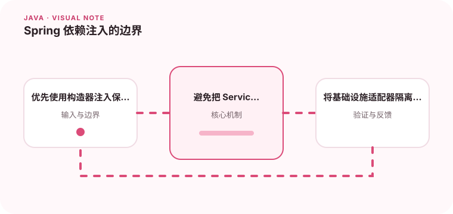

依赖注入让对象组装从业务逻辑中分离出来，重点是保持依赖方向清楚。

## 为什么值得理解

依赖注入的核心是让对象只声明自己需要什么，由外部负责组装。这样业务类可以独立测试，基础设施实现也能替换，而不会把 Spring API 扩散到每一层。

## 工作原理

构造器注入在对象创建时保证依赖完整，接口定义调用方向，配置类选择具体实现。Bean 作用域和生命周期决定实例是否共享，因此可变状态尤其需要谨慎。

## 实战场景

订单服务可以依赖 PaymentGateway 接口，生产环境注入 HTTP 实现，测试中注入内存桩。业务用例不需要知道 Bean 名称、URL 配置或客户端创建细节。

## 常见误区

字段注入会隐藏必需依赖并增加测试难度；把容器当服务定位器则让任何类都能随意获取对象。循环依赖通常提示职责划分出了问题，不应只靠延迟初始化掩盖。

## 实践清单

- 优先使用构造器注入保证依赖完整。
- 避免把 Service 变成什么都能访问的上帝对象。
- 将基础设施适配器隔离在边界层。
- 记录关键假设、验证数据和回滚条件
- 将稳定结论沉淀为测试或自动化检查

## 动手练习

把一个直接 new 数据库客户端的服务重构为构造器注入，分别提供真实和测试实现。检查核心类是否仍能在不启动 Spring 的情况下运行单元测试。

## 小结

学习“Spring 依赖注入的边界”时，重点不是记住全部术语，而是能解释机制、识别边界并用证据验证选择。把实验结果、失败样本和决策依据一起留下，下一次面对类似问题时才能更快做出可靠判断。
