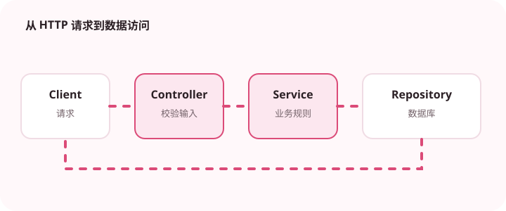

从 Controller 到 Service 再到 Repository 的分层，应该服务于职责分离而不是堆叠文件。

## 为什么值得理解

Spring Web 的分层应让请求协议、业务规则和数据访问各自有清楚边界。层数不是目标，目标是修改 HTTP 格式时不影响核心规则，替换存储时不重写接口。

## 工作原理

Controller 负责解析与校验输入，Service 执行业务用例，Repository 封装持久化。DTO、领域对象和数据库实体承担不同语义，异常处理器把内部失败映射成稳定响应。

## 实战场景

创建订单接口先校验数量与地址格式，再由服务检查库存和价格，最后在仓储中写入。返回响应时不直接暴露数据库实体，避免内部字段和懒加载行为泄漏。

## 常见误区

常见误区是 Controller 堆满业务逻辑、Service 只做无意义转发，或让 Repository 返回 HTTP 响应。自动映射工具也不能替代对字段权限的判断。

## 实践清单

- 输入 DTO 与领域对象分开。
- 统一处理参数错误和业务错误。
- 避免 Controller 直接拼接数据库细节。
- 记录关键假设、验证数据和回滚条件
- 将稳定结论沉淀为测试或自动化检查

## 动手练习

实现一个带参数校验和统一错误格式的最小接口，分别测试合法请求、缺失字段、业务冲突和数据库失败，确认每层只处理自己的职责。

## 小结

学习“Spring Web 请求链路拆解”时，重点不是记住全部术语，而是能解释机制、识别边界并用证据验证选择。把实验结果、失败样本和决策依据一起留下，下一次面对类似问题时才能更快做出可靠判断。
