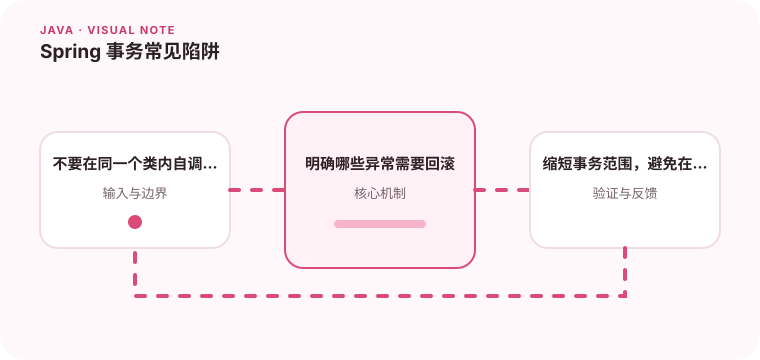

事务是否生效不仅取决于注解，还取决于代理、调用路径和数据库引擎。

## 为什么值得理解

事务保证一组数据库操作以一致方式提交或回滚，但注解是否生效取决于代理调用、异常类型和数据库能力。正确边界应围绕一个业务一致性单元。

## 工作原理

Spring 通常通过代理在方法前后开启和结束事务。类内自调用绕过代理，受检异常默认行为也可能与预期不同；传播级别则决定嵌套调用复用还是创建新事务。

## 实战场景

创建订单时扣库存、写订单和记录支付意图需要一致提交，但调用外部支付接口不应长时间占用数据库事务。可以先提交本地状态，再用事件或补偿推进外部流程。

## 常见误区

常见误区包括在 private 方法上加注解、捕获异常后不再抛出导致提交，以及在事务中执行慢网络请求。长事务还会扩大锁范围并增加死锁概率。

## 实践清单

- 不要在同一个类内自调用来期待事务代理。
- 明确哪些异常需要回滚。
- 缩短事务范围，避免在事务中调用慢服务。
- 记录关键假设、验证数据和回滚条件
- 将稳定结论沉淀为测试或自动化检查

## 动手练习

编写一个包含类内调用、运行时异常和受检异常的示例，观察数据库结果。再把外部等待移出事务，比较锁持有时间和失败恢复方式。

## 小结

学习“Spring 事务常见陷阱”时，重点不是记住全部术语，而是能解释机制、识别边界并用证据验证选择。把实验结果、失败样本和决策依据一起留下，下一次面对类似问题时才能更快做出可靠判断。
