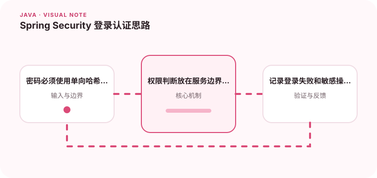

认证回答你是谁，授权回答你能做什么，两者需要在系统中分开建模。

## 为什么值得理解

认证确认调用者身份，授权判断其能否执行某项操作。两者分开后，登录方式可以变化，而业务权限仍保持稳定，也更容易做审计和最小权限控制。

## 工作原理

请求先经过安全过滤链提取凭据，再由认证组件验证身份并建立安全上下文。方法或资源授权基于角色、权限与对象归属判断，不能只依赖前端是否显示按钮。

## 实战场景

文档系统中，普通用户可以读取公开文档，作者能编辑自己的草稿，管理员可处理违规内容。这里既有角色权限，也有“资源属于谁”的对象级判断。

## 常见误区

不要把明文密码、Token 或完整认证头写入日志，也不要用可逆加密保存密码。只校验 Token 签名而忽略过期、签发方和受众同样存在风险。

## 实践清单

- 密码必须使用单向哈希并配合安全参数。
- 权限判断放在服务边界而非只依赖前端。
- 记录登录失败和敏感操作审计信息。
- 记录关键假设、验证数据和回滚条件
- 将稳定结论沉淀为测试或自动化检查

## 动手练习

为一个读写接口配置匿名、用户和管理员三种访问规则，补充越权测试与登录失败审计。检查禁用账户和过期令牌是否都被正确拒绝。

## 小结

学习“Spring Security 登录认证思路”时，重点不是记住全部术语，而是能解释机制、识别边界并用证据验证选择。把实验结果、失败样本和决策依据一起留下，下一次面对类似问题时才能更快做出可靠判断。
