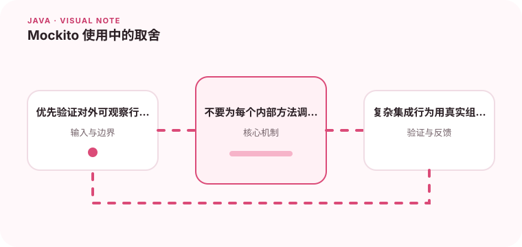

Mock 可以隔离外部协作者，但过度 Mock 会让测试绑死实现细节。

## 为什么值得理解

Mockito 用来控制不可预测的协作者，例如远程接口、时钟或消息发布器。它帮助把测试范围收窄，但无法证明真实组件之间的协议一定兼容。

## 工作原理

stub 定义依赖在特定输入下的返回或异常，verify 检查重要副作用是否发生。Mock 应围绕接口边界使用，测试主体仍应通过返回值和状态变化验证业务行为。

## 实战场景

通知服务调用邮件网关时，可以模拟成功、超时和永久失败，验证重试与状态记录。邮件内容格式则可直接捕获参数断言，而不是验证每个内部私有方法。

## 常见误区

常见误区是深层链式 Mock、对每次 getter 都 verify，或 patch 错对象导致测试实际上没有隔离依赖。过多 Mock 往往说明类承担了太多职责。

## 实践清单

- 优先验证对外可观察行为。
- 不要为每个内部方法调用都写 verify。
- 复杂集成行为用真实组件测试更可靠。
- 记录关键假设、验证数据和回滚条件
- 将稳定结论沉淀为测试或自动化检查

## 动手练习

为一个依赖网关和仓储的用例编写测试，只 Mock 两个外部边界。随后重构内部方法，确认测试无需修改；再补一个真实适配器的集成测试。

## 小结

学习“Mockito 使用中的取舍”时，重点不是记住全部术语，而是能解释机制、识别边界并用证据验证选择。把实验结果、失败样本和决策依据一起留下，下一次面对类似问题时才能更快做出可靠判断。
