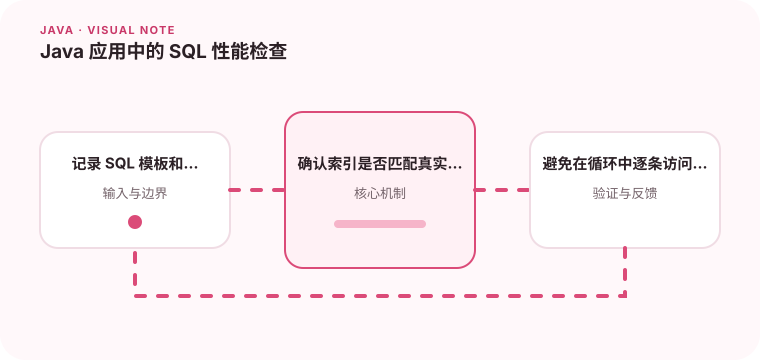

应用层的慢查询往往不是 Java 代码本身慢，而是查询计划、索引和数据量出了问题。

## 为什么值得理解

Java 服务的数据库性能取决于 SQL、索引、数据分布、连接池和事务共同作用。只看应用代码耗时，容易错过 N+1 查询或执行计划变化。

## 工作原理

数据库根据统计信息选择访问路径，合适索引可以减少扫描，但索引过多会增加写成本。ORM 的懒加载和循环查询可能把一次业务请求扩成数百条 SQL。

## 实战场景

列表接口随数据增长变慢时，先记录查询模板、耗时和返回行数，再查看执行计划。若过滤字段组合不匹配索引，应根据真实查询模式调整，而不是盲目加单列索引。

## 常见误区

不要在日志中输出敏感参数，也不要只在空测试库测性能。连接池开得过大可能压垮数据库，分页中的深 offset 也会随着页码增加变慢。

## 实践清单

- 记录 SQL 模板和耗时，不要泄露敏感参数。
- 确认索引是否匹配真实过滤条件。
- 避免在循环中逐条访问数据库。
- 记录关键假设、验证数据和回滚条件
- 将稳定结论沉淀为测试或自动化检查

## 动手练习

准备不同数据量和选择度的数据集，对同一查询比较无索引、单列索引和联合索引的计划。再制造 N+1，记录修复前后的 SQL 数量与延迟。

## 小结

学习“Java 应用中的 SQL 性能检查”时，重点不是记住全部术语，而是能解释机制、识别边界并用证据验证选择。把实验结果、失败样本和决策依据一起留下，下一次面对类似问题时才能更快做出可靠判断。
