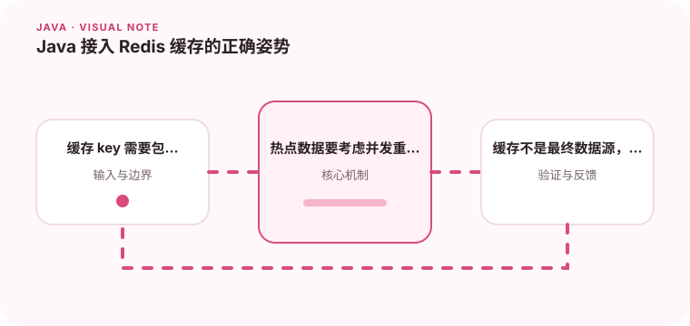

缓存可以降低延迟，但同时引入一致性、穿透、击穿和雪崩问题。

## 为什么值得理解

缓存把热点数据放到更快的存储中，但会引入数据新鲜度和故障恢复问题。是否值得缓存，应由访问频率、计算成本和可接受过期时间决定。

## 工作原理

常见读路径是先查缓存，未命中再读数据源并回填。TTL 控制最长陈旧时间，失效策略决定写入后如何同步；热点键还需要互斥重建或逻辑过期避免击穿。

## 实战场景

商品详情读多写少，可设置短 TTL 并在更新后删除缓存。若大量请求同时遇到过期，只允许一个请求重建，其余等待或返回可接受的旧值。

## 常见误区

缓存不能成为唯一数据源，也不要让 key 缺少租户或版本边界。随机 TTL 只能缓解同一时刻过期，无法解决错误回填和下游容量不足。

## 实践清单

- 缓存 key 需要包含版本或租户边界。
- 热点数据要考虑并发重建。
- 缓存不是最终数据源，失败时要有降级路径。
- 记录关键假设、验证数据和回滚条件
- 将稳定结论沉淀为测试或自动化检查

## 动手练习

实现带空值缓存、随机 TTL 和并发重建的查询，模拟 Redis 不可用、热点过期和数据更新，观察系统是否仍能保护数据库并返回可解释结果。

## 小结

学习“Java 接入 Redis 缓存的正确姿势”时，重点不是记住全部术语，而是能解释机制、识别边界并用证据验证选择。把实验结果、失败样本和决策依据一起留下，下一次面对类似问题时才能更快做出可靠判断。
