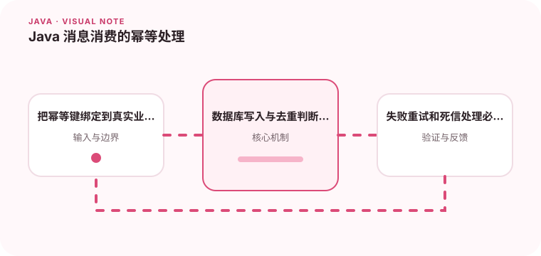

消息可能重复投递，消费端必须让重复执行不会造成错误结果。

## 为什么值得理解

消息系统通常采用至少一次投递，因此重复消息是正常现象。幂等消费让同一业务事件处理多次仍得到相同结果，是可靠异步流程的基础。

## 工作原理

消费端先提取业务唯一键，在同一原子边界内判断是否处理并写入结果。状态机适合表达处理中、成功和失败；去重记录则要与业务数据保持一致。

## 实战场景

支付成功事件重复到达时，账户入账必须只发生一次。可以用支付流水号建立唯一约束，让重复插入自然失败并返回已有结果，而不是依赖内存 Set。

## 常见误区

仅按消息队列生成的 messageId 去重可能失效，因为业务重发会产生新 ID。先写去重表再处理业务也可能在中途崩溃后永久跳过，必须设计原子性。

## 实践清单

- 把幂等键绑定到真实业务语义。
- 数据库写入与去重判断要考虑原子性。
- 失败重试和死信处理必须可观测。
- 记录关键假设、验证数据和回滚条件
- 将稳定结论沉淀为测试或自动化检查

## 动手练习

模拟同一事件重复、乱序和处理中宕机，验证最终余额与状态。记录重试次数和死信原因，并提供按业务键安全重放的工具。

## 小结

学习“Java 消息消费的幂等处理”时，重点不是记住全部术语，而是能解释机制、识别边界并用证据验证选择。把实验结果、失败样本和决策依据一起留下，下一次面对类似问题时才能更快做出可靠判断。
