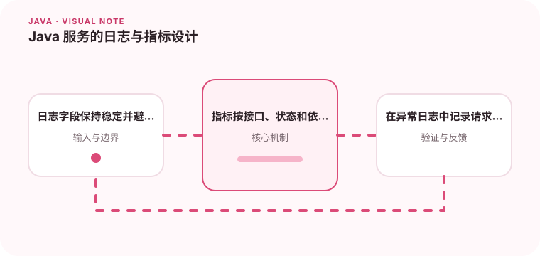

可观测性不是输出更多日志，而是让请求、错误和资源变化可以被关联。

## 为什么值得理解

可观测性让团队从系统输出推断内部状态。日志、指标和追踪各自回答事件细节、趋势变化和跨服务链路，三者需要使用共同的请求标识关联。

## 工作原理

结构化日志保存稳定字段，指标聚合请求量、错误率与延迟分位数，Trace 展示一次请求跨越的服务和耗时。业务指标还应表达订单成功率等用户结果。

## 实战场景

当接口 P99 上升但平均值正常时，可以先按端点和状态码拆分指标，再从慢请求 trace 找到具体下游，最后查看对应实例日志确认参数与异常。

## 常见误区

日志越多不等于越可观测。高基数字段会让指标系统成本激增，敏感数据写日志会造成安全风险，缺少版本和环境字段也会让问题无法关联发布。

## 实践清单

- 日志字段保持稳定并避免拼接大段文本。
- 指标按接口、状态和依赖维度聚合。
- 在异常日志中记录请求关联信息。
- 记录关键假设、验证数据和回滚条件
- 将稳定结论沉淀为测试或自动化检查

## 动手练习

为一个请求贯穿 Controller、数据库和外部服务传递 traceId，设计三项技术指标与一项业务指标。制造超时后验证告警能否指向真正依赖。

## 小结

学习“Java 服务的日志与指标设计”时，重点不是记住全部术语，而是能解释机制、识别边界并用证据验证选择。把实验结果、失败样本和决策依据一起留下，下一次面对类似问题时才能更快做出可靠判断。
