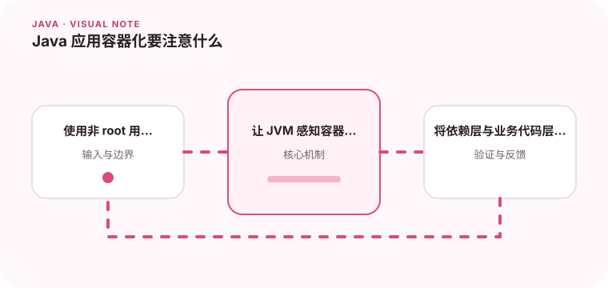

容器化不仅是把 JAR 放进镜像，还要处理启动、信号、内存和分层缓存。

## 为什么值得理解

容器化的目标是让 Java 应用以可重复、可限制和可观测的方式运行。镜像构建、进程信号、内存上限与健康检查都会影响上线行为。

## 工作原理

镜像由只读层组成，把依赖与业务代码分层可提高缓存命中。容器中的 JVM 需要识别 cgroup 限制，PID 1 还必须正确接收终止信号以完成优雅停机。

## 实战场景

部署 Spring Boot 服务时，可以先暴露就绪与存活检查，收到 SIGTERM 后停止接收新请求，再等待进行中任务结束。滚动发布才不会频繁产生半途失败。

## 常见误区

不要把密钥写进镜像，也不要默认容器内存等于 JVM 堆。只设置 -Xmx 而忽略线程栈、元空间和直接内存，仍可能被系统 OOM Kill。

## 实践清单

- 使用非 root 用户运行应用。
- 让 JVM 感知容器内存限制。
- 将依赖层与业务代码层分开缓存。
- 记录关键假设、验证数据和回滚条件
- 将稳定结论沉淀为测试或自动化检查

## 动手练习

构建一个非 root、分层缓存的镜像，设置明确内存限制并触发优雅停机。比较首次与仅修改业务代码后的构建时间，检查日志中是否能看到退出流程。

## 小结

学习“Java 应用容器化要注意什么”时，重点不是记住全部术语，而是能解释机制、识别边界并用证据验证选择。把实验结果、失败样本和决策依据一起留下，下一次面对类似问题时才能更快做出可靠判断。
