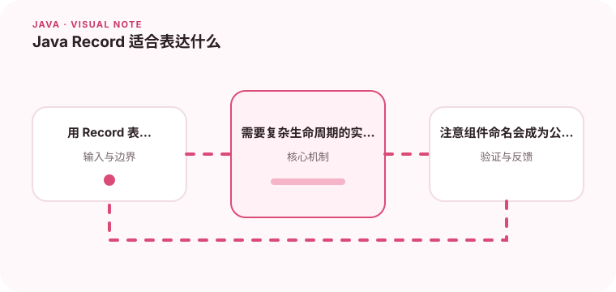

Record 适合不可变数据载体，但不应该被当作所有领域对象的替代品。

## 为什么值得理解

Record 适合表达由一组值定义的数据载体，自动提供访问器、相等性和字符串表示。它减少样板代码，也清楚传达“这个类型主要保存数据”的意图。

## 工作原理

Record 组件在构造后不可重新赋值，但组件引用的可变对象仍可能改变。紧凑构造器可执行校验和规范化，equals 与 hashCode 基于全部组件。

## 实战场景

坐标、金额或 API 响应可以用 Record 表达；订单实体则通常拥有身份、状态变化和生命周期，不应只因为字段多就改成 Record。

## 常见误区

把 Record 等同于深度不可变是常见误区。若组件是 List，需要复制或包装；组件名称也属于公开 API，随意改名会影响序列化和调用方。

## 实践清单

- 用 Record 表达值对象和请求响应模型。
- 需要复杂生命周期的实体仍保留明确的类行为。
- 注意组件命名会成为公开 API 的一部分。
- 记录关键假设、验证数据和回滚条件
- 将稳定结论沉淀为测试或自动化检查

## 动手练习

实现一个带金额校验和列表组件的 Record，测试相等性与序列化。尝试修改传入列表，观察防御性复制前后的差异。

## 小结

学习“Java Record 适合表达什么”时，重点不是记住全部术语，而是能解释机制、识别边界并用证据验证选择。把实验结果、失败样本和决策依据一起留下，下一次面对类似问题时才能更快做出可靠判断。
