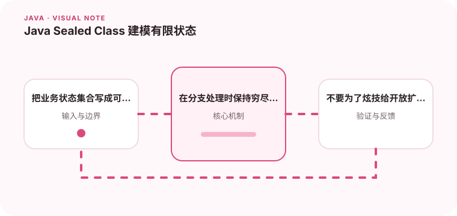

当一个类型的合法子类型是有限集合时，密封类型可以帮助编译器发现遗漏分支。

## 为什么值得理解

密封类型适合业务中合法子类型有限且已知的场景。编译器能利用封闭集合检查分支是否遗漏，让状态处理比字符串和松散继承更安全。

## 工作原理

sealed 声明允许的直接子类型，子类型必须继续选择 final、sealed 或 non-sealed。结合模式匹配，可以根据具体类型安全读取对应数据。

## 实战场景

支付结果可建模为 Success、Declined 和 Pending，每种结果携带不同字段。处理函数覆盖全部分支后，新增结果类型会在编译期提醒所有调用点。

## 常见误区

不要给需要第三方扩展的 SPI 使用 sealed，也不要创建只为语法完整、没有业务含义的子类型。密封层次过深会增加理解成本。

## 实践清单

- 把业务状态集合写成可读的类型层次。
- 在分支处理时保持穷尽性。
- 不要为了炫技给开放扩展点加密封。
- 记录关键假设、验证数据和回滚条件
- 将稳定结论沉淀为测试或自动化检查

## 动手练习

把使用 type 字符串和 nullable 字段的结果对象改成密封类型，补充穷尽分支。新增一个状态，观察编译器能否指出遗漏处理。

## 小结

学习“Java Sealed Class 建模有限状态”时，重点不是记住全部术语，而是能解释机制、识别边界并用证据验证选择。把实验结果、失败样本和决策依据一起留下，下一次面对类似问题时才能更快做出可靠判断。
