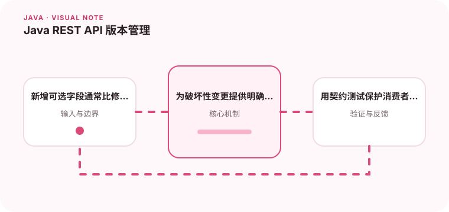

API 版本管理的目标是让客户端有迁移时间，而不是让路径无限增长。

## 为什么值得理解

API 版本管理的核心是控制兼容性和迁移节奏。稳定契约能让客户端独立发布，而不是每次服务端改字段都同时升级所有消费者。

## 工作原理

兼容演进通常通过新增可选字段、保持旧语义和明确默认值完成。破坏性变更才需要新版本，并配合弃用通知、使用统计和迁移文档。

## 实战场景

订单响应需要拆分地址字段时，可以先保留旧 address，同时新增结构化 shippingAddress；观察客户端迁移率后再按计划下线旧字段。

## 常见误区

不要因为任何小改动都增加 URL 版本，也不要悄悄改变字段单位或空值语义。只靠文档声明兼容而没有契约测试，风险仍会在发布时暴露。

## 实践清单

- 新增可选字段通常比修改旧字段安全。
- 为破坏性变更提供明确迁移窗口。
- 用契约测试保护消费者依赖。
- 记录关键假设、验证数据和回滚条件
- 将稳定结论沉淀为测试或自动化检查

## 动手练习

为一个响应模型设计兼容新增和破坏性修改两套方案，用消费者契约测试验证旧客户端。制定包含时间、负责人和流量证据的弃用计划。

## 小结

学习“Java REST API 版本管理”时，重点不是记住全部术语，而是能解释机制、识别边界并用证据验证选择。把实验结果、失败样本和决策依据一起留下，下一次面对类似问题时才能更快做出可靠判断。
