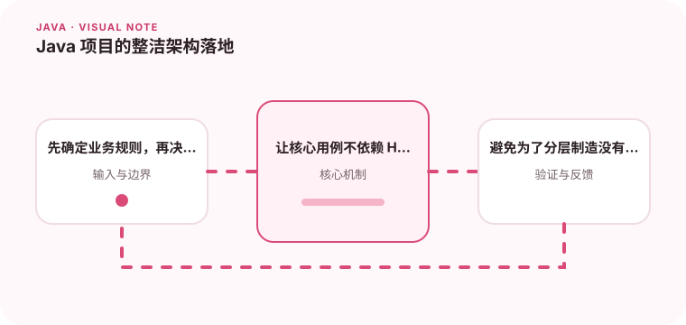

架构分层的核心是依赖方向和业务规则的独立性。

## 为什么值得理解

整洁架构关注依赖方向：业务规则不应依赖 Web 框架、数据库或消息系统。这样核心用例可以独立测试，外部技术也能在明确边界替换。

## 工作原理

用例定义应用行为，领域对象保存业务规则，端口描述核心需要的能力，适配器实现 HTTP、数据库等细节。依赖从外向内指向稳定的业务层。

## 实战场景

创建订单用例可以依赖库存端口和订单仓储接口，Spring Controller 负责输入转换，JPA 适配器负责持久化。核心代码无需导入 Spring 或 JPA 注解。

## 常见误区

常见误区是为了分层创建大量只转发一次的类，或者把领域对象做成只含 getter 的贫血结构。架构边界应解决变化问题，不是追求目录数量。

## 实践清单

- 先确定业务规则，再决定框架位置。
- 让核心用例不依赖 HTTP 或 ORM。
- 避免为了分层制造没有意义的转发类。
- 记录关键假设、验证数据和回滚条件
- 将稳定结论沉淀为测试或自动化检查

## 动手练习

选择一个现有用例，画出依赖方向并把框架类型移出核心接口。用内存适配器运行测试，再替换真实数据库实现，确认用例代码不变。

## 小结

学习“Java 项目的整洁架构落地”时，重点不是记住全部术语，而是能解释机制、识别边界并用证据验证选择。把实验结果、失败样本和决策依据一起留下，下一次面对类似问题时才能更快做出可靠判断。
