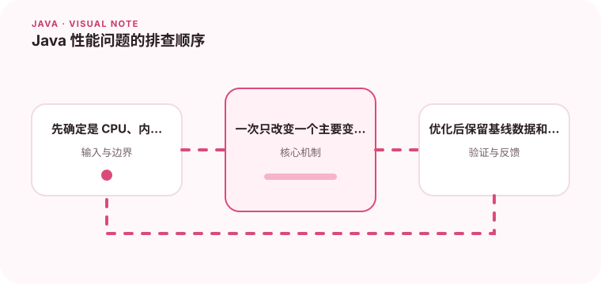

性能优化需要从用户感知的指标开始，而不是先修改一堆 JVM 参数。

## 为什么值得理解

性能排查应从用户可感知的慢请求或资源异常开始，再用证据定位 CPU、内存、锁或 I/O。没有基线的优化很难判断收益，也容易制造新问题。

## 工作原理

指标先确定异常时间与范围，线程转储观察阻塞和热点，火焰图展示 CPU 栈占比，堆分析寻找对象滞留。不同证据应在同一负载和版本下关联。

## 实战场景

接口在高峰期变慢时，先比较正常与异常时段的吞吐、P99 和线程状态。若大量线程等待连接池，应继续检查慢 SQL 或下游，而不是先优化 JSON 序列化。

## 常见误区

不要凭一次 profiler 截图修改代码，也不要在没有复现条件时同时调整线程池、GC 和缓存。微基准结果若脱离真实数据和调用链，可能完全误导。

## 实践清单

- 先确定是 CPU、内存、锁还是 I/O 瓶颈。
- 一次只改变一个主要变量。
- 优化后保留基线数据和回滚方案。
- 记录关键假设、验证数据和回滚条件
- 将稳定结论沉淀为测试或自动化检查

## 动手练习

构造可重复负载，保存优化前的延迟与资源基线；用采样剖析找出最大热点，只改一个变量后重新测试，并记录收益、代价和回滚条件。

## 小结

学习“Java 性能问题的排查顺序”时，重点不是记住全部术语，而是能解释机制、识别边界并用证据验证选择。把实验结果、失败样本和决策依据一起留下，下一次面对类似问题时才能更快做出可靠判断。
