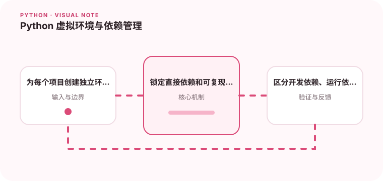

隔离环境是保证项目可复现的第一步。

## 为什么值得理解

虚拟环境隔离项目依赖，避免一个项目升级库后破坏另一个项目。它也是构建可复现环境的起点，让开发机、CI 和生产环境使用同一组明确版本。

## 工作原理

venv 会创建独立的解释器入口和 site-packages，激活只是调整当前 shell 的查找路径。依赖清单描述需要安装什么，锁文件进一步固定解析后的版本与校验信息。

## 实战场景

维护两个分别依赖不同 Django 版本的项目时，每个项目都应拥有独立环境。CI 从空环境安装锁定依赖，能及时发现遗漏的间接依赖或系统库。

## 常见误区

不要把虚拟环境目录提交进仓库，也不要只记录 pip freeze 后的巨大列表而不区分直接依赖。系统级库、Python 版本和平台差异同样需要写进构建说明。

## 实践清单

- 为每个项目创建独立环境。
- 锁定直接依赖和可复现版本。
- 区分开发依赖、运行依赖和系统依赖。
- 记录输入输出、关键假设和失败样本
- 将稳定规则沉淀为测试或自动化检查

## 动手练习

创建两个虚拟环境并安装同一库的不同版本，验证它们互不影响。随后删除环境，仅根据项目配置重建，并比较包版本和测试结果是否一致。

## 小结

学习“Python 虚拟环境与依赖管理”时，先从真实输入和失败边界出发，再选择语言特性或库。保留可重复示例、测试和观察数据，才能判断方案是否真的可靠，也方便未来升级依赖或调整实现。
