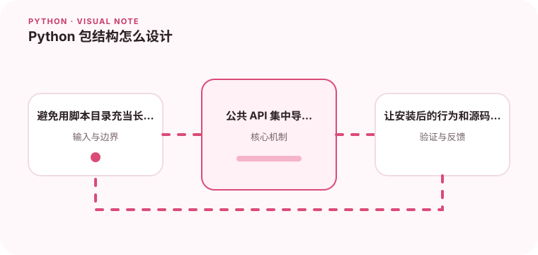

一个清晰的包结构能减少导入问题，也让测试和发布更容易。

## 为什么值得理解

清晰的包结构决定导入是否稳定、测试是否贴近安装后的行为，以及项目能否顺利发布。目录组织应表达模块边界，而不是把所有脚本堆在根目录。

## 工作原理

src 布局把可导入包放在 src 下，避免测试意外引用工作目录中的源码。pyproject.toml 描述构建后端、元数据和依赖，__init__ 只应导出稳定公共接口。

## 实战场景

一个命令行工具可分成领域逻辑、外部适配器和 CLI 入口。安装后通过 console script 启动，测试则导入同一包，而不是修改 sys.path 找到源码。

## 常见误区

常见误区是包名与顶层脚本重名、使用隐式相对导入，或把构建产物提交进源码。循环导入通常说明模块职责互相依赖，需要重新划分边界。

## 实践清单

- 避免用脚本目录充当长期包结构。
- 公共 API 集中导出并保持稳定。
- 让安装后的行为和源码目录一致。
- 记录输入输出、关键假设和失败样本
- 将稳定规则沉淀为测试或自动化检查

## 动手练习

把一个由多个散落脚本组成的小项目改成 src 布局，构建 wheel 后在全新环境安装。运行测试和命令行入口，确认不依赖仓库当前目录。

## 小结

学习“Python 包结构怎么设计”时，先从真实输入和失败边界出发，再选择语言特性或库。保留可重复示例、测试和观察数据，才能判断方案是否真的可靠，也方便未来升级依赖或调整实现。
