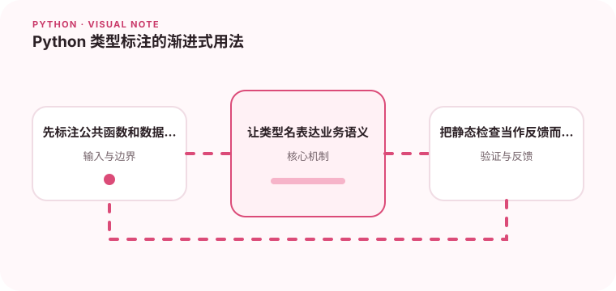

类型标注不是把 Python 变成 Java，而是帮助工具和团队更早发现误用。

## 为什么值得理解

类型标注为编辑器、静态检查器和读者提供函数契约，尤其适合公共接口和数据边界。它不会改变 Python 的动态本质，但能提前发现字段误用和空值遗漏。

## 工作原理

标注在运行时通常只是对象元数据，mypy、pyright 等工具负责静态分析。Union 表达多种可能，Optional 明确可为空，Protocol 按行为描述兼容对象。

## 实战场景

读取配置后返回 Optional[str] 时，调用方必须处理缺失；若接口接受实现 read 方法的对象，可以用 Protocol，避免要求所有实现继承同一基类。

## 常见误区

不要用 Any 消除所有报错，也不要为了满足检查器写与运行时不一致的强制转换。类型标注不能替代外部 JSON、环境变量和用户输入的实际校验。

## 实践清单

- 先标注公共函数和数据边界。
- 让类型名表达业务语义。
- 把静态检查当作反馈而不是形式审查。
- 记录输入输出、关键假设和失败样本
- 将稳定规则沉淀为测试或自动化检查

## 动手练习

选择一个无标注模块，从公共函数开始补类型，并启用严格检查。修复暴露出的空值和容器元素问题，再写一个 Protocol 替换不必要的具体类依赖。

## 小结

学习“Python 类型标注的渐进式用法”时，先从真实输入和失败边界出发，再选择语言特性或库。保留可重复示例、测试和观察数据，才能判断方案是否真的可靠，也方便未来升级依赖或调整实现。
